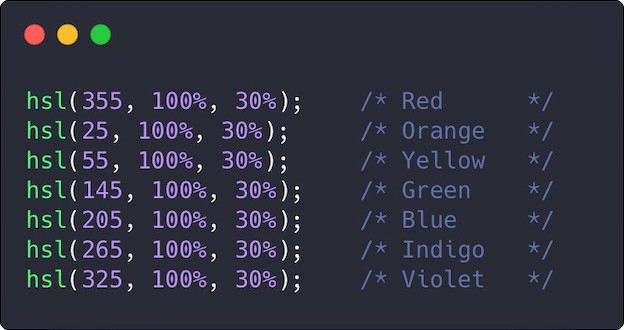
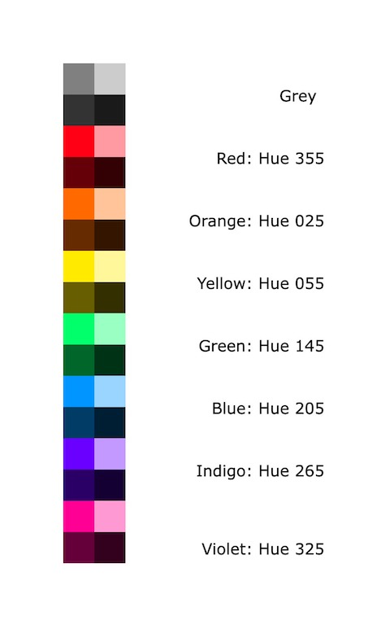
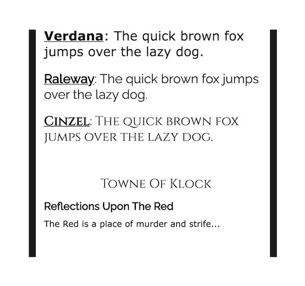

# Towne of Klock (ToK)

## Gameplay

Idle Crafting RPG 

*   Players Passively accumulate components
*   Players Make better components through combining items
*   Players craft things like skills, inventories, weapons, and armor using components
*   Everything has value, from low level components to end level components, weigh the oppertunity cost of items not crafted vs what is crafted
*   Everything can be crafted (including mobs and time acceleration)
*   Microtransactions to aquire certain compnents like time acceleration.

Player owned space is the called the white room.

Player's can expand their space by planting tiles.

Tiles may hold a single crop, mob (non player character), or player character

 

